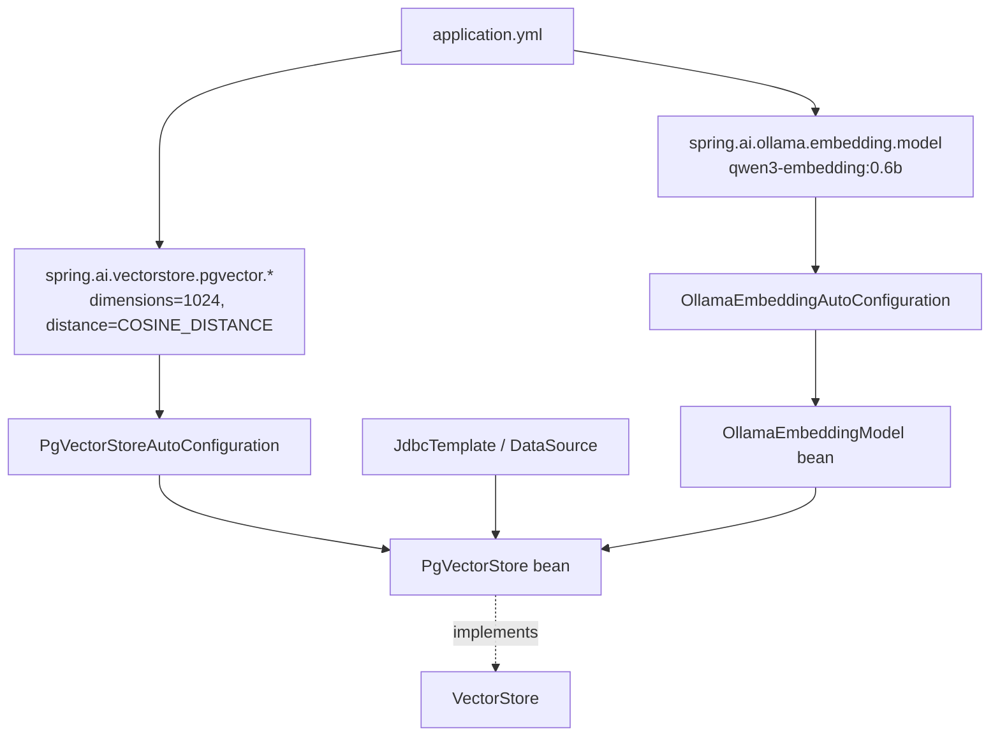
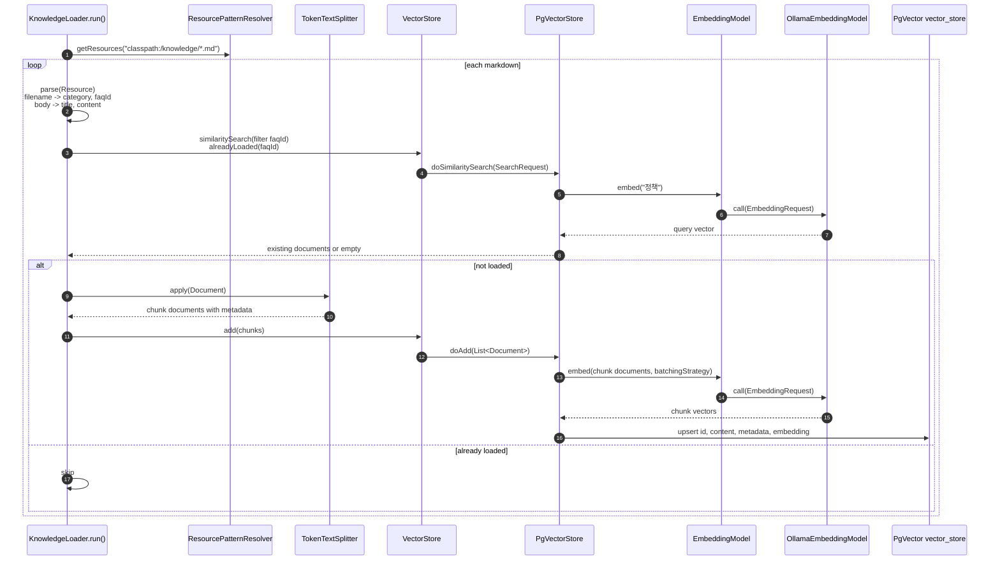
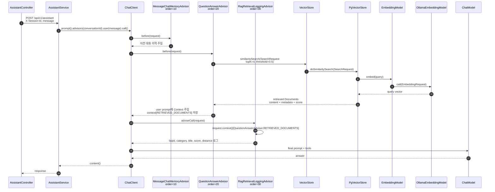

# loop-play-spring-ai-agent

## Round 4 - RAG로 배달 정책/FAQ 지식 연동

이 README는 Round 4 진행을 위해 새로 시작한 문서입니다.
Round 3까지의 Chat Memory 실험과 검증 내용은 [docs/round3-backup.md](docs/round3-backup.md)에 보관했습니다.

Round 3까지 만든 에이전트는 "그거 취소해줘"처럼 이전 대화의 주문번호를 이어받는 질문을 처리할 수 있게 됐습니다.
하지만 환불 정책, 지연 보상 기준, 쿠폰 중복 규칙처럼 배달 서비스의 실제 정책 문서가 필요한 질문은 Tool Calling이나 Chat Memory만으로 해결할 수 없습니다.
Round 4는 정책/FAQ 문서를 검색해서 LLM 프롬프트에 넣어 주는 RAG를 붙이는 라운드입니다.

이번 라운드의 한 줄 메시지는 단순합니다.
RAG를 "연결하는 것"은 Advisor 한 줄에 가깝지만, 정작 어려운 건 얼마나 쪼갤지, 몇 건을 가져올지, 얼마 이상의 유사도를 신뢰할지, 모를 땐 어떻게 답할지 판단하는 일입니다.

## 실행 환경

- Java 17
- Spring Boot 3.4.1
- Spring AI 1.0.0
- Chat model: Ollama `qwen3:4b`
- Embedding model: Ollama `qwen3-embedding:0.6b`
- VectorStore: PgVector
- Local database: Docker Compose로 실행하는 PostgreSQL + pgvector
- Local PgVector port: `15432`

이번 Round 4는 단순히 `QuestionAnswerAdvisor`를 붙이는 데서 끝내지 않습니다.
정책 문서가 실제로 임베딩되어 PgVector에 적재되는지, API 응답이 정책 원문을 근거로 바뀌는지, Memory와 RAG가 함께 붙었을 때 어떤 케이스가 성공하고 실패하는지까지 실험 결과로 확인합니다.

## 이번 라운드에 배우는 것

- 왜 RAG가 필요한가를 LLM의 학습 데이터 한계, 최신성, 도메인 특화 지식의 세 관점에서 설명합니다.
- RAG의 두 파이프라인인 indexing과 retrieval을 구분합니다.
- Spring AI의 `VectorStore`, `EmbeddingModel`, `TokenTextSplitter`, `QuestionAnswerAdvisor` 역할을 구분합니다.
- PgVector를 Docker로 띄우고 `initialize-schema: true`로 schema가 자동 생성되는 과정을 관찰합니다.
- 문서 chunking의 크기와 overlap trade-off를 설명하고, 값을 바꿔 검색 품질 변화를 관찰합니다.
- Round 3의 `MessageChatMemoryAdvisor`와 Round 4의 `QuestionAnswerAdvisor`가 같은 chain에서 어떻게 협업하는지 로그로 확인합니다.
- 검색 결과가 없을 때의 fallback 전략을 similarity threshold와 system prompt로 설계합니다.

## 학습 목표

- [x] 왜 RAG가 필요한가를 LLM의 학습 데이터 한계, 최신성, 도메인 특화 지식의 세 관점에서 설명할 수 있다.
- [x] RAG의 두 파이프라인인 indexing과 retrieval을 말로 설명할 수 있다.
- [x] 임베딩 벡터의 직관을 "의미가 가까우면 거리가 가깝다"로 설명하고, 키워드 검색과의 차이를 말할 수 있다.
- [x] `VectorStore`, `EmbeddingModel`, `TokenTextSplitter`, `QuestionAnswerAdvisor`의 역할을 구분할 수 있다.
- [x] Chunk size와 overlap trade-off를 설명하고, 값을 바꿔 검색 품질 변화를 관찰할 수 있다.
- [x] Memory Advisor와 QA Advisor가 같은 chain에서 어떻게 협업하는지 로그로 설명할 수 있다.
- [x] 검색 결과가 없을 때의 fallback 전략을 similarity threshold와 system prompt로 설계할 수 있다.

## 1부. 왜 RAG가 필요한가 - LLM이 모르는 것을 답하게 하는 법

### 1.1 Round 3까지의 한계

지금까지 우리 에이전트는 "그거 취소해줘"까지는 잘 해결하게 됐습니다.
하지만 아래 질문들은 성격이 다릅니다.

```text
고객: 배달 완료 후에도 환불 받을 수 있나요?
봇:   배달의 환불 정책이 뭐였더라...

고객: 비 오는 날 배달이 늦으면 보상 받을 수 있나요?
봇:   "비 오는 날"에 관한 공식 정책이 있었나...

고객: 쿠폰 적용이 안 돼요. 중복 사용 가능한가요?
봇:   쿠폰 중복 규칙이 뭐였지...
```

이 질문들은 주문번호를 기억한다고 풀리지 않고, 주문 Tool을 호출한다고 풀리지도 않습니다.
필요한 것은 배달 서비스의 실제 정책 문서입니다.

핵심은 LLM이 만능 지식 저장소가 아니라는 점입니다.
배달의 환불 규정, 지연 보상 기준, 쿠폰 정책 같은 도메인 특화 지식은 모델 학습 데이터에 들어있다고 기대하면 안 됩니다.
RAG는 LLM이 모르는 지식을 검색해서 프롬프트에 넣어 준다는 단순한 아이디어이고, 그래서 강력합니다.

### 1.2 RAG가 해결하는 세 가지 문제

| 문제 | 예시 | RAG 없이는 |
| --- | --- | --- |
| LLM 학습 데이터에 없는 지식 | 배달 환불 정책, 지연 보상 기준 | LLM이 그럴듯하게 꾸며낸 환각 응답 |
| 최신성 | 이번 달 이벤트, 어제 개정된 쿠폰 정책 | 파인튜닝으로 따라잡기 어려운 비용과 주기 |
| 출처 추적 가능성 | "이 답의 근거 문서가 뭔가?"라는 감사 요구 | LLM 응답만으로는 근거 확인이 어려움 |

### 1.3 그냥 Tool로 검색 API를 만들면 안 되는가?

Tool로 `searchPolicy(keyword)`를 만드는 것도 가능한 설계입니다.
실제 서비스에서도 정책 검색을 명시적으로 통제해야 하거나, 검색 실행 자체를 audit log로 남겨야 한다면 Tool 방식이 더 적합할 수 있습니다.

다만 상담 도메인에서는 고객이 "환불 정책 검색해줘"라고 말하기보다 "배달 완료됐는데 환불 돼요?"라고 묻는 경우가 대부분입니다.

| 방식 | 설계 | 언제 쓰나 |
| --- | --- | --- |
| Tool 방식 | `searchPolicy(keyword)` Tool을 만들고 LLM이 필요할 때 호출 | 고객이 검색 의도를 명시하거나, 검색 실행 자체를 통제해야 할 때 |
| RAG 방식 | 사용자 질문을 자동으로 임베딩하고, 검색 결과를 프롬프트에 주입 | 고객 질문 자체가 이미 정책 검색을 필요로 하는 상담일 때 |

이번 Round 4에서는 RAG 방식이 더 자연스럽습니다.
검색 의도를 별도로 감지하지 않아도 모든 질문에 대해 관련 정책을 찾아 프롬프트에 넣을 수 있기 때문입니다.

### 1.4 RAG의 두 흐름을 큰 그림으로만 보기

RAG는 크게 두 흐름으로 나뉩니다.

인덱싱은 정책 문서를 미리 읽어 검색 가능한 형태로 저장하는 흐름입니다.
앱 기동 시 또는 문서가 갱신될 때 실행되고, Markdown 정책 문서를 `Document`로 바꾼 뒤 벡터 저장소에 넣습니다.

검색은 고객 요청마다 실행되는 흐름입니다.
사용자 질문과 의미가 가까운 정책 조각을 찾고, 그 검색 결과를 LLM 프롬프트의 `Context`로 붙입니다.
LLM은 이 `Context`를 근거로 답변합니다.

```text
정책 문서 -> 인덱싱 -> VectorStore
고객 질문 -> 검색 -> Context 주입 -> LLM 답변
```

1부에서 기억할 것은 이것만으로 충분합니다.
RAG는 "모르는 정책을 LLM에게 외우게 하는 방식"이 아니라 "필요한 순간에 찾아서 보여주는 방식"입니다.

## 2부. Spring AI RAG 구성요소

### 2.1 EmbeddingModel - 문장을 벡터로 바꾸는 모델

`EmbeddingModel`은 텍스트를 벡터로 바꿉니다.
이번 라운드에서는 Ollama의 `qwen3-embedding:0.6b`를 사용합니다.

```yaml
spring:
  ai:
    ollama:
      embedding:
        model: qwen3-embedding:0.6b
```

핵심 직관은 의미가 가까운 문장은 벡터 공간에서도 가깝다는 것입니다.

```text
"환불 받을 수 있나요?"   -> [0.21, -0.15, 0.42, ...]
"돈 돌려받을 수 있어요?" -> [0.19, -0.14, 0.41, ...]  의미가 가까움
"치킨 2마리 주문할게요"  -> [0.75, -0.02, -0.33, ...] 의미가 멂
```

중요한 제약이 하나 있습니다.
인덱싱 때 쓴 임베딩 모델과 검색 때 쓴 임베딩 모델은 같아야 합니다.
서로 다른 임베딩 모델이 만든 벡터는 같은 좌표계에 있지 않기 때문에 거리 비교가 의미 없어집니다.

### 2.2 VectorStore - 벡터 저장과 유사도 검색

`VectorStore`는 임베딩 벡터, 원문 텍스트, metadata를 함께 저장하고 `similaritySearch`로 가까운 문서를 찾아줍니다.
이번 라운드에서는 PgVector를 사용합니다.

```yaml
spring:
  ai:
    vectorstore:
      pgvector:
        initialize-schema: true
        dimensions: 1024
        distance-type: COSINE_DISTANCE
        index-type: HNSW
```

`initialize-schema: true`를 켜면 Spring AI가 PgVector 확장과 `vector_store` 테이블을 자동으로 준비합니다.
덕분에 교육용 실험에서는 SQL DDL을 직접 작성하지 않고도 인덱싱을 바로 관찰할 수 있습니다.

### 2.3 TokenTextSplitter - 정책 문서를 검색 가능한 단위로 나누기

정책 문서를 통째로 하나의 벡터로 만들면 질문과의 유사도가 뭉툭해집니다.
A4 10장짜리 문서 전체를 벡터 하나에 압축하면, 실제 답은 한 문단에만 있어도 전체 문서의 평균적인 의미로 검색됩니다.
또 답에 필요한 조각은 일부인데 전체 문서를 프롬프트에 넣으면 입력 토큰이 늘고 노이즈도 커집니다.

그래서 문서를 적당한 크기의 chunk로 쪼개고, 각 chunk를 독립적으로 임베딩합니다.

| 청크 크기 | 장점 | 단점 |
| --- | --- | --- |
| 작게, 200~400 토큰 | 검색 정확도가 높아질 수 있음 | 앞뒤 맥락이 잘릴 수 있음 |
| 중간, 600~1000 토큰 | 정확도와 맥락 보존의 균형 | 실험으로 맞춰야 할 튜닝 포인트가 많음 |
| 크게, 1500~3000 토큰 | 맥락을 많이 보존 | 유사도가 뭉툭해지고 토큰 낭비가 커질 수 있음 |

현재 구현은 아래 설정을 기본값으로 둡니다.

```java
new TokenTextSplitter(
        800,
        350,
        5,
        10_000,
        true
);
```

이 값은 정답이 아니라 출발점입니다.
검색 결과의 `faqId`, 입력 토큰 수, 실제 API 답변을 같이 보면서 조정해야 합니다.

### 2.4 QuestionAnswerAdvisor - 검색 결과를 프롬프트에 붙이는 Advisor

`QuestionAnswerAdvisor`는 매 요청마다 질문을 임베딩하고, VectorStore에서 관련 문서를 찾고, 검색 결과를 프롬프트에 `Context`로 주입합니다.
애플리케이션 코드에서는 Advisor chain에 한 번 등록하면 됩니다.

```java
SearchRequest searchRequest = SearchRequest.builder()
        .topK(4)
        .similarityThreshold(0.5)
        .build();

return QuestionAnswerAdvisor.builder(vectorStore)
        .searchRequest(searchRequest)
        .order(20)
        .build();
```

현재 chain 순서는 다음처럼 잡습니다.

| Advisor | order | 역할 |
| --- | ---: | --- |
| `MessageChatMemoryAdvisor` | 10 | 이전 대화 이력 주입 |
| `QuestionAnswerAdvisor` | 20 | 정책/FAQ 검색 결과 주입 |
| `PerformanceLoggingAdvisor` | 100 | 최종 프롬프트와 호출 비용 관찰 |

Bean은 생성자에서 한 번 주입받아 `ChatClient`를 구성합니다.
핸들러 메서드 안에서 매 요청마다 `defaultAdvisors(...)`를 다시 호출하지 않습니다.
Round 2에서 본 빌더 누적 문제와 매 요청 인스턴스 생성을 피하기 위해서입니다.

### 2.5 Spring AI 내부 구현을 열어 보면

Spring AI 1.0.0 source jar와 binary class를 기준으로 확인한 실제 흐름입니다.
핵심은 `QuestionAnswerAdvisor`가 직접 임베딩을 만드는 것이 아니라 `VectorStore.similaritySearch(...)`를 호출하고, `PgVectorStore`가 내부의 `EmbeddingModel`을 사용한다는 점입니다.

자동 구성은 아래처럼 연결됩니다.



소스에서 확인한 주요 메서드는 아래와 같습니다.

```java
// org.springframework.ai.embedding.EmbeddingModel
default float[] embed(String text) {
    return this.embed(List.of(text)).iterator().next();
}

default List<float[]> embed(List<Document> documents,
                            EmbeddingOptions options,
                            BatchingStrategy batchingStrategy) {
    List<String> texts = subBatch.stream().map(Document::getText).toList();
    EmbeddingResponse response = this.call(new EmbeddingRequest(texts, options));
    ...
}

// org.springframework.ai.ollama.OllamaEmbeddingModel
public EmbeddingResponse call(EmbeddingRequest request) {
    OllamaApi.EmbeddingsRequest ollamaEmbeddingRequest = ollamaEmbeddingRequest(embeddingRequest);
    EmbeddingsResponse response = this.ollamaApi.embed(ollamaEmbeddingRequest);
    ...
}
```

인덱싱 파이프라인은 앱 기동 시 `KnowledgeLoader.run(...)`에서 시작합니다.



검색 파이프라인은 매 사용자 요청마다 Advisor chain 안에서 실행됩니다.
여기서 만들어지는 RAG context는 이번 LLM 호출에 붙는 임시 context이지, 사용자별 장기 memory가 아닙니다.



`QuestionAnswerAdvisor` binary class에서 확인한 주요 필드는 아래와 같습니다.

```java
public class QuestionAnswerAdvisor implements BaseAdvisor {
    public static final String RETRIEVED_DOCUMENTS;
    private final VectorStore vectorStore;
    private final SearchRequest searchRequest;

    public ChatClientRequest before(ChatClientRequest request, AdvisorChain chain) { ... }
}
```

`PgVectorStore` binary class에서 확인한 주요 메서드는 아래와 같습니다.

```java
public class PgVectorStore extends AbstractObservationVectorStore {
    public void doAdd(List<Document> documents);
    public List<Document> doSimilaritySearch(SearchRequest request);
    private PGvector getQueryEmbedding(String query);
    private String comparisonOperator();
}
```

우리 코드에서 이 흐름을 연결하는 지점은 `RagConfig`와 `ChatClientConfig`입니다.

```java
// RagConfig
SearchRequest searchRequest = SearchRequest.builder()
        .topK(4)
        .similarityThreshold(0.5)
        .build();

return QuestionAnswerAdvisor.builder(vectorStore)
        .searchRequest(searchRequest)
        .order(20)
        .build();

// ChatClientConfig
.defaultAdvisors(
        messageChatMemoryAdvisor,
        questionAnswerAdvisor,
        ragRetrievalLoggingAdvisor,
        performanceLoggingAdvisor
)
```

## 3부. 인덱싱 파이프라인 - 정책 문서를 실제로 넣기

### 3.1 PgVector 실행

로컬 5432 포트는 이미 다른 PostgreSQL이 사용 중이어서 Round 4의 PgVector는 host port `15432`로 띄웁니다.

```bash
docker compose up -d
```

애플리케이션 설정은 아래처럼 이 PgVector를 바라봅니다.

```yaml
spring:
  datasource:
    url: jdbc:postgresql://localhost:15432/baedal
    username: baedal
    password: baedal
```

앱을 한 번 기동하면 `initialize-schema: true`에 의해 PgVector 관련 extension과 `vector_store` 테이블이 생성됩니다.
실제 확인 결과 extension은 아래처럼 준비됐습니다.

| extension |
| --- |
| `hstore` |
| `plpgsql` |
| `uuid-ossp` |
| `vector` |

### 3.2 KnowledgeLoader

정책 문서는 `src/main/resources/knowledge` 아래 Markdown 파일로 둡니다.
파일명은 `{category}__{id}.md` 규칙을 사용합니다.

```text
refund__refund-basic.md
refund__refund-after-delivered.md
delivery-delay__weather-delay.md
coupon__coupon-faq.md
```

이 규칙 덕분에 loader는 파일명만 보고 category와 전역 id를 안정적으로 뽑을 수 있습니다.
문서 본문은 임베딩 대상이 되고, metadata에는 `faqId`, `title`, `category`를 넣습니다.

```java
new Document(
        faq.id(),
        faq.content(),
        Map.of(
                "faqId", faq.id(),
                "title", faq.title(),
                "category", faq.category()
        )
);
```

중복 적재는 `VectorStore`에 id 조회 API가 없기 때문에 metadata filter 기반의 `similaritySearch`로 막습니다.

```java
SearchRequest.builder()
        .query("정책")
        .topK(1)
        .similarityThresholdAll()
        .filterExpression("faqId == '" + faqId + "'")
        .build();
```

프로덕션에서는 문서 해시나 별도 seed audit table을 두는 편이 낫습니다.
이번 라운드에서는 교육용으로 VectorStore API 안에서 끝나는 단순 전략을 선택했습니다.

### 3.3 PDF 문서는 어떻게 볼 것인가

이번 starter는 Markdown 정책/FAQ를 사용합니다.
Markdown은 문서 구조가 단순하고 Git diff가 잘 보여서 RAG의 핵심인 indexing, retrieval, threshold 실험에 집중하기 좋습니다.

PDF도 가능합니다.
다만 PDF는 텍스트 추출 품질, 표 구조 보존, 페이지 header/footer 제거, OCR 여부가 검색 품질에 직접 영향을 줍니다.
그래서 PDF는 `PagePdfDocumentReader` 같은 Reader를 붙이는 별도 실험으로 두는 것이 좋습니다.
Round 4의 핵심 목표는 "파일 형식"이 아니라 "검색된 정책 근거가 답변을 바꾸는가"입니다.

### 3.4 실제 적재 결과

앱 기동 후 `vector_store`에는 정책 문서 7건이 적재됐습니다.

| faqId | category | title |
| --- | --- | --- |
| `cancel-policy` | `cancel` | 주문 취소 가능 시간과 수수료 |
| `coupon-faq` | `coupon` | 쿠폰 적용 및 중복 사용 규칙 |
| `delay-compensation` | `delivery-delay` | 배달 지연 보상 기준 |
| `privacy` | `account` | 개인정보 및 계정 보안 안내 |
| `refund-after-delivered` | `refund` | 배달 완료 후 환불 가능 조건 |
| `refund-basic` | `refund` | 환불 기본 정책 |
| `weather-delay` | `delivery-delay` | 기상 악화 시 배달 지연 정책 |

재기동 시에는 같은 `faqId`가 이미 있으면 skip하도록 구성했습니다.
이 부분은 단위 테스트로도 검증했습니다.

## 4부. Retrieval/API 검증, Memory 협업, Fallback

### 4.1 정책 질문은 RAG로 답이 바뀌는가

실제 API로 확인한 결과, 정책 문서에 있는 수치와 조건이 응답에 반영됐습니다.

```bash
curl -sS -X POST http://localhost:18080/api/v1/assistant \
  -H 'Content-Type: application/json' \
  -H 'X-Customer-Id: customer-1' \
  -H 'X-Session-Id: rag-refund-1' \
  -d '{"message":"배달 완료 후에도 환불 받을 수 있나요?"}'
```

| 질문 | 응답에서 확인한 정책 근거 | 판단 |
| --- | --- | --- |
| 배달 완료 후에도 환불 받을 수 있나요? | "배달 완료 후 24시간 이내", "메뉴 누락, 오배송, 품질 불량, 수량 오류" | 성공 |
| 비 오는 날 배달이 늦으면 보상 받을 수 있나요? | "비가 온다는 사실만으로는 보상 가능하지 않음", "기상 특보", "사전 고지" | 성공 |
| 쿠폰 적용이 안 돼요. 중복 사용 가능한가요? | "할인 쿠폰과 배달비 쿠폰은 함께 사용 가능", "할인 쿠폰끼리 중복 사용 불가" | 성공 |

여기서 확인한 것은 "RAG 연결이 실제 API 응답에 영향을 준다"는 점입니다.
아직 확인하지 않은 것은 threshold와 chunk size를 바꿨을 때 어떤 문서가 탈락하거나 섞이는지입니다.

### 4.2 Memory와 RAG는 같은 chain에서 협업하는가

단순한 이어말하기 케이스는 성공했습니다.

```text
고객: 2024-1234 배달 상황 알려주세요
봇:   2024-1234는 DELIVERING 상태이고 역삼역 사거리 부근입니다.

고객: 아까 그 주문 환불 돼요?
봇:   주문 상태가 배달 중이므로 현재 환불이 불가능합니다.
      배달 완료 후 24시간 이내에 문제가 발생하면 환불 절차를 진행해 주세요.
```

이 응답은 두 가지가 같이 필요합니다.
Memory는 "아까 그 주문"을 이전 턴의 `2024-1234`와 이어 주고, RAG는 환불 정책 문서를 프롬프트에 넣어 줍니다.

한 세션에 여러 주문이 섞인 경우는 Round 3에서 이미 봤듯 더 어렵습니다.
초기 구현에서는 아래 흐름이 실패했습니다.

```text
고객: 2024-1234 배달 어디쯤이에요?
봇:   2024-1234는 DELIVERING 상태입니다.

고객: 2024-1235 주문은 뭐 시킨 거예요?
봇:   2024-1235 관련 응답

고객: 아까 배달 중이던 주문 환불 돼요?
초기 봇: 주문번호를 알려주세요.
```

이 실패는 RAG 검색 문제가 아니었습니다.
로그상 RAG는 `refund-basic`, `refund-after-delivered`, `cancel-policy`를 찾고 있었습니다.
문제는 "배달 중이던"이라는 조건을 이전 tool 결과의 `DELIVERING` 상태와 연결하지 못한 데 있었습니다.

그래서 tool 결과를 세션 상태로 정규화했습니다.
`getDeliveryStatus` 또는 `getOrderDetail` 결과에 `orderId`, `status`가 있으면 `ConversationOrderStateRepository`에 저장하고, 다음 사용자 문장에 "배달 중이던"이 포함되며 `DELIVERING` 주문이 정확히 하나이면 사용자 프롬프트에 서버 확인 문맥을 붙입니다.

```text
[서버 확인]
사용자가 말한 "배달 중이던 주문"은 주문번호 2024-1234입니다.
```

보강 후 실제 API 결과는 `2024-1234`를 정확히 특정했습니다.

```text
핵심 답변: 주문번호 2024-1234는 현재 배달 중입니다.
...
```

이 방식의 기준은 보수적입니다.
`DELIVERING` 주문이 0개이거나 2개 이상이면 서버가 임의로 고르지 않고 기존처럼 LLM/확인 흐름에 맡깁니다.

### 4.3 Fallback과 관찰 로그 보강

초기 구현에서는 상담 범위 밖 질문이 실패했습니다.

| 시나리오 | 기대 | 초기 결과 | 보강 후 |
| --- | --- | --- | --- |
| "오늘 점심 뭐 먹을까요?" | 주문/배달/환불/쿠폰 상담 범위가 아니라고 안내 | 앱 메뉴에서 점심 메뉴를 선택하라고 답변 | 고정 fallback을 즉시 반환하고 LLM/RAG 호출 없음 |
| 정책 질문 retrieval 관찰 | 어떤 FAQ가 검색됐는지 확인 | 프롬프트 토큰만 간접 확인 | `faqId`, `category`, `title`, `score`, `distance` 로그 출력 |

실제 fallback 응답은 아래처럼 고정했습니다.

```text
저는 주문/배달/환불/쿠폰 관련 상담을 도와드리고 있어요. 관련 문의를 남겨주시면 도와드릴게요.
```

이 guard는 명백한 범위 밖 추천/잡담만 막습니다.
"문제가 생겼어요", "그거 취소해줘"처럼 상담 맥락일 수 있는 짧은 문장은 막지 않습니다.

RAG 관찰 로그 예시는 아래와 같습니다.

```text
[RAG] retrieved documents. count=2,
documents=[
  faqId=refund-after-delivered, category=refund, title=배달 완료 후 환불 정책, score=0.6524, distance=0.34755427,
  faqId=refund-basic, category=refund, title=환불 기본 정책, score=0.5884, distance=0.41162595
]
```

정책 원문 전체는 로그에 남기지 않고, 검색 품질을 판단할 수 있는 metadata와 점수만 남깁니다.

### 4.4 명시 주문 조회 질문의 tool-use determinism

Round 4를 진행하면서 RAG와 별개의 문제가 하나 더 드러났습니다.
정책 질문은 RAG가 잘 처리하지만, "2024-1235 주문은 뭐 시킨 거예요?"처럼 주문번호와 읽기 의도가 모두 명시된 질문은 굳이 LLM이 tool을 고를 때까지 기다릴 필요가 없습니다.
이 질문은 정책 검색 문제가 아니라 서버가 이미 가진 주문 데이터를 읽는 문제입니다.

그래서 명시 주문번호의 read-only 질문에는 세 가지 전략을 비교했습니다.

```yaml
baedal:
  assistant:
    order-read:
      strategy: prefetch
```

| 전략 | 동작 | 장점 | 단점 |
| --- | --- | --- | --- |
| `prompt-only` | 프롬프트 규칙만 강화하고 LLM이 tool을 고르게 둠 | 구조가 가장 단순함 | tool 호출 여부와 latency가 LLM에 흔들림 |
| `prefetch` | 서버가 주문 상세/배달 상태를 먼저 조회하고 `[서버 확인]` context를 LLM에 붙임 | 자연어 응답은 유지하면서 데이터 선택은 deterministic | 여전히 LLM 호출 비용은 듦 |
| `router` | 명시 주문번호의 read-only 질문은 service layer가 직접 응답 | 가장 빠르고 안정적 | 답변 스타일이 고정되고, 복합 상담에는 LLM 유연성이 줄어듦 |

실제 API로 같은 질문을 세 전략에 적용했습니다.

```bash
curl -sS -X POST http://localhost:18080/api/v1/assistant \
  -H 'Content-Type: application/json' \
  -H 'X-Customer-Id: customer-1' \
  -H 'X-Session-Id: strategy-prefetch' \
  -d '{"message":"2024-1235 주문은 뭐 시킨 거예요?"}'
```

| 전략 | 실제 응답 요약 | 관찰 로그 |
| --- | --- | --- |
| `prompt-only` | `2024-1235`의 떡볶이 1개, 튀김 1개를 답함 | `getOrderDetail`을 결국 호출했지만 `elapsedMs=33690`, `totalTokens=4578` |
| `prefetch` | 같은 메뉴와 총 금액 `14,000원`을 답함 | tool 실행 로그 없이 서버 context를 붙여 한 번의 LLM 호출, `elapsedMs=20173`, `totalTokens=2061` |
| `router` | `주문번호 2024-1235는 떡볶이 1개, 튀김 1개...`를 즉시 반환 | `order read routed without LLM`, LLM/Advisor 호출 없음 |

기본값은 `prefetch`로 둡니다.
교육용 에이전트에서는 LLM 답변 스타일과 관찰 가능한 Advisor chain을 유지하면서, 주문 데이터 선택만 서버가 고정하는 절충안이 가장 설명하기 좋기 때문입니다.
운영 서비스라면 명시 주문 조회, 결제 상태 조회, 배송 상태 조회처럼 답이 정형적인 read-only intent는 `router`로 빼는 편이 더 낫습니다.

이 전략은 A/B 주문 참조 문제에도 도움이 됩니다.
한 세션에서 `2024-1234`의 배달 상태와 `2024-1235`의 주문 상세를 모두 확인한 뒤 "아까 배달 중이던 주문 환불 돼요?"라고 물으면, 서버 상태에는 `2024-1234=DELIVERING`, `2024-1235=CREATED`가 남습니다.
그 다음 환불 질문은 LLM/RAG chain으로 보내되 사용자 프롬프트에 아래 context를 붙입니다.

```text
[서버 확인]
사용자가 말한 "배달 중이던 주문"은 주문번호 2024-1234입니다.
```

실제 로그에서도 환불 질문의 RAG 검색은 `refund-basic`, `cancel-policy`, `refund-after-delivered`를 찾았고, tool 호출은 `getDeliveryStatus(orderId=2024-1234)`로 실행됐습니다.
즉 최근 주문인 `2024-1235`가 아니라 상태 조건에 맞는 `2024-1234`를 선택했습니다.

### 4.5 완료한 검증과 품질 실험 결과

여기까지로 Round 4의 핵심 구현은 끝났습니다.
이 절에서는 "RAG가 연결됐는가"가 아니라 "검색 품질과 운영 안전성을 어느 값에서 신뢰할 것인가"를 실제 API로 확인합니다.

먼저 이미 확인한 항목은 아래와 같습니다.

| 항목 | 상태 | 근거 |
| --- | --- | --- |
| PgVector schema 자동 생성 | 완료 | `initialize-schema: true`로 `vector_store`, `vector` extension 생성 확인 |
| Markdown 정책 문서 적재 | 완료 | `KnowledgeLoader`가 7개 FAQ를 적재하고 재기동 시 skip |
| 정책 질문 RAG 응답 | 완료 | 환불, 기상 지연, 쿠폰 질문에서 정책 수치/조건 반영 |
| Fallback guard | 완료 | 범위 밖 질문은 LLM/RAG 호출 없이 고정 응답 |
| Memory + RAG 협업 | 완료 | "아까 그 주문 환불"에서 주문 참조와 정책 검색 결합 |
| 여러 주문 A/B 참조 | 완료 | `DELIVERING` 상태 주문을 구조화해 "배달 중이던 주문"을 `2024-1234`로 resolve |
| Tool-use determinism 대안 | 완료 | `prompt-only`, `prefetch`, `router` 실제 API 비교 |

실험을 반복하려면 값을 코드 상수로 박아두면 안 됩니다.
그래서 `RagConfig`의 `topK`, `similarityThreshold`, `chunkSize`를 아래 설정으로 뺐습니다.

```yaml
baedal:
  rag:
    top-k: 4
    similarity-threshold: 0.5
    chunk-size: 800
```

실제 API 실험 결과는 아래와 같습니다.

| 실험 | 상태 | 값 | 관찰 결과 | 결론 |
| --- | --- | --- | --- | --- |
| Similarity threshold | 완료 | `0.3` | 환불 질문에서 `refund-after-delivered`, `refund-basic` 외에 `delay-compensation`, `cancel-policy`도 통과. 기상 질문에도 환불 문서가 섞임. | 낮은 threshold는 답은 맞아도 context noise와 토큰 비용이 커짐 |
| Similarity threshold | 완료 | `0.5` | 환불은 refund 2건, 기상은 delivery-delay 2건, 쿠폰은 coupon 1건만 검색됨. | 현재 문서와 `qwen3-embedding:0.6b` 조합의 기본값으로 가장 균형적 |
| Similarity threshold | 완료 | `0.7` | 환불/기상 질문은 검색 결과 0건으로 fallback. 쿠폰만 `coupon-faq(score=0.7162)` 통과. | 너무 높으면 정답 문서가 탈락함 |
| Top-K | 완료 | `1` | 환불 질문에서 `refund-after-delivered` 1건만 검색. USER prompt 987 chars, totalTokens 3194. | 비용은 낮지만 보조 정책 문맥이 줄어듦 |
| Top-K | 완료 | `4` | 환불 질문에서 4건 검색. refund 2건 외 지연/취소 문서도 포함. USER prompt 3089 chars, totalTokens 4659. | threshold가 낮으면 topK 4도 노이즈가 섞임 |
| Top-K | 완료 | `8` | 환불 질문에서 6건 검색. 쿠폰/기상 문서까지 포함. USER prompt 4368 chars, totalTokens 4991. | topK를 키우면 recall은 늘지만 토큰과 noise가 같이 늘어남 |
| Chunk size | 완료 | `300` | 7개 FAQ가 총 14청크로 적재. 환불 질문에서 refund 조각 3건과 cancel 1건 검색. | 짧은 정책 문서에서는 과분할로 중복/인접 noise가 생김 |
| Chunk size | 완료 | `800` | 7개 FAQ가 총 7청크로 적재. 환불 질문에서 refund 2건만 검색. | 현재 Markdown 정책 문서에는 가장 단순하고 안정적 |
| Chunk size | 완료 | `1500` | 7개 FAQ가 총 7청크로 적재. 800과 동일한 검색 결과. | 현재 문서가 짧아 800과 품질 차이가 없음 |
| RAG context memory 격리 | 완료 | 고객 A/B 세션 교차 호출 | customer-1의 `isolation` 세션에는 원래 user/assistant 메시지만 저장. RAG Context 전문은 저장되지 않음. customer-2의 같은 세션 조회는 `[]`. | `conversationId=customerId:sessionId` 격리와 Advisor 임시 context 동작 확인 |
| Prompt fallback 강도 | 완료 | 문서에 없는 정책 질문 | "드론 배달 파손 보험 보상 기준" 질문에서 RAG 검색 0건, 상담원 연결 fallback 응답. | 시스템 프롬프트의 모름 규칙이 동작함 |
| PDF reader 선택 실험 | 완료 | `spring-ai-pdf-document-reader` smoke test | `PagePdfDocumentReader`가 임시 PDF에서 정책 텍스트를 추출함. 다만 추출 텍스트는 공백이 크게 늘어 whitespace normalization이 필요했음. | PDF는 가능하지만 Markdown보다 추출 품질 정제가 필요하므로 별도 loader로 분리하는 편이 맞음 |

이번 실험의 결론은 보수적으로 잡습니다.
현재 Round 4 기본값은 `similarityThreshold=0.5`, `topK=4`, `chunkSize=800`을 유지합니다.
다만 낮은 threshold와 큰 topK를 함께 쓰면 무관 문서가 쉽게 섞이므로, 실무에서는 질문 세트별 score 분포를 먼저 측정한 뒤 값을 정해야 합니다.

## 5부. 미션 제출 보강 기록

이 절은 미션 루브릭에 맞춰 2026-06-08 실제 API로 다시 확인한 제출 증거입니다.
실험 로그는 작업트리 오염을 피하려고 `/private/tmp/baedal-round4-*` 아래에 남겼고, README에는 평가에 필요한 핵심 발췌만 기록합니다.

### 5.1 1단계 시나리오 5종

`vector_store` 카테고리 분포는 기준 설정(`chunkSize=800`, `minChunkSizeChars=350`)에서 아래와 같았습니다.

```text
 rows |    category
------+----------------
    1 | account
    1 | cancel
    1 | coupon
    2 | delivery-delay
    2 | refund
```

| # | 질문 | 검색 결과 발췌 | 응답/판단 |
| --- | --- | --- | --- |
| 1 | 비 오는 날 배달이 늦으면 보상 받을 수 있나요? | `delay-compensation(score=0.5916)`, `weather-delay(score=0.5253)` | "비가 온다는 사실만으로는 보상 어려움", "기상 특보", "예상 시간 기준" 반영 |
| 2 | 결제 후 바로 취소하면 환불되나요? | `refund-basic(score=0.5309)` | `CREATED` 또는 `ACCEPTED`이면 전액 환불 가능, 조리 시작 후 제한 |
| 3 | 쿠폰 중복 사용되나요? | `coupon-faq(score=0.6379)` | 할인 쿠폰 + 배달비 쿠폰 가능, 할인 쿠폰끼리 불가 |
| 4 | 가게랑 빨리 조율해야 해서 앱 대표번호 말고 사장님한테 바로 닿는 연락 수단 알려주세요 | `privacy(score=0.5076)` | 개인 전화번호 제공 거절, 앱에 등록된 가게 대표번호 안내 |
| 5 | `2024-1234 배달 어디?` -> `아까 그 주문 환불 돼요?` | 2턴에서 `refund-basic`, `cancel-policy` 검색 | Memory가 `2024-1234`를 유지하고, RAG가 환불/취소 정책을 주입 |

개인정보 시나리오는 일부러 "사장님 전화번호"보다 우회된 표현으로 다시 돌렸습니다.
처음에는 `privacy` 문서가 threshold 아래로 떨어졌고, 원인은 정책 문서가 "개인 연락처"라는 표현만 갖고 있어 "전화번호" 질문과 의미 거리가 멀어진 것이었습니다.
그래서 `account__privacy.md`에 실제 고객 표현을 한 줄 추가했습니다.

```markdown
- 고객이 "사장님 전화번호 알려주세요", "가게 사장님 연락처 주세요"처럼 요청해도 개인 전화번호는 안내하지 않습니다.
```

보강 후 우회 질문은 `privacy(score=0.5076)`로 검색됐고, 응답은 아래처럼 전화번호를 노출하지 않았습니다.

```text
고객: 가게랑 빨리 조율해야 해서 앱 대표번호 말고 사장님한테 바로 닿는 연락 수단 알려주세요
봇: 고객님, 앱에 등록된 가게 대표번호로 직접 연락해 주세요.
    사장님의 개인 전화번호는 제공하지 않습니다.
```

### 5.2 2단계 청킹 전략 실험

각 실험 전에 `TRUNCATE TABLE vector_store;`로 인덱스를 비우고 앱을 재기동했습니다.
다섯 번째 질문인 "오늘 점심 뭐 먹을까요?"는 `AssistantScopeGuard`가 LLM/RAG 호출 전에 고정 fallback을 반환하므로 입력 토큰을 `0`으로 계산했습니다.

| 실험 | chunkSize / minChars | vector_store row 수 | promptTokens, 5턴 | 평균 입력 토큰 | 답변 품질 |
| --- | --- | ---: | --- | ---: | --- |
| A | `800 / 350` | 7 | `2465, 2016, 2004, 2440, 0` | 1785 | 만족 |
| B | `100 / 40` | 49 | `1855, 1796, 1841, 1815, 0` | 1461 | 애매 |
| C | `2000 / 800` | 7 | `2465, 2016, 2004, 2440, 0` | 1785 | 만족 |

품질 기준은 다음처럼 잡았습니다.
정책 원문 수치와 조건을 모두 포함하면 `만족`, 정답 방향은 맞지만 일부 조건이 빠지거나 문맥이 조각나면 `애매`, 잘못된 정책을 말하면 `불만족`입니다.

chunkSize=100의 대표 실패는 환불 문서가 아래처럼 끊겨 들어온 것입니다.

```text
faqId=refund-after-delivered, score=0.7360,
content="# 배달 완료 후 환불 정책

배달이 완료된 상태에서도 아래 사유에 한해 환불을 요청할 수 있습니다.

## 배달 완료 후 환불 가능 사유

1."
```

이 경우 LLM 응답은 큰 방향은 맞았지만 `메뉴 누락/오배송/품질 불량/수량 오류` 전체 목록을 안정적으로 인용하지 못하고, "음식 누락 또는 오배송 등"처럼 일부만 뭉개졌습니다.
기상 질문에서도 `예상 시간 + 30~59분` 보상 조건이 Top-K에 들어오지 않아 "60분 이상" 중심으로 답했습니다.
작은 청크는 row 수가 늘고 검색 점수는 좋아 보일 수 있지만, Top-K가 조각난 문장만 가져오면 정책 조건 전체를 잃습니다.

chunkSize=2000은 이번 Markdown 정책 문서가 짧아서 800과 같은 7청크가 됐습니다.
그래서 "row 수가 A보다 적어지는" 현상은 이 데이터셋에서는 관찰되지 않았습니다.
다만 장문 PDF나 여러 조항이 섞인 문서라면 2000 토큰 청크 하나에 여러 주제가 섞이면서 질문 벡터와의 유사도가 평균화되고, context 토큰 비용도 커질 가능성이 높습니다.

청크 오버랩은 경계에서 조건과 숫자가 분리되는 문제를 완화합니다.
예를 들어 "예상 시간 + 30~59분"과 "배달비 전액 환불 또는 3,000원 쿠폰"이 경계에 걸리면 숫자만 있거나 보상만 있는 청크가 검색될 수 있습니다.
오버랩은 이런 인접 문맥을 일부 중복 저장하는 비용을 내고 검색 안정성을 높이는 장치입니다.

사용자 리뷰 10만 건이라면 정책 문서와 다르게 잡습니다.
리뷰는 문서 하나가 아니라 짧은 독립 샘플이 많으므로 리뷰 1건 또는 의미 단락 단위로 작게 유지하고, 중복 방지는 `reviewId`와 content hash를 metadata에 넣습니다.
재인덱싱은 전체 재적재보다 신규/수정 리뷰만 증분 처리하고, 오래된 리뷰는 시간 가중치나 별도 partition으로 관리합니다.

### 5.3 Fallback 없는 환각 관찰

현재 구현은 2중 방어를 둡니다.
1차는 `AssistantScopeGuard`가 명백한 범위 밖 질문을 LLM 전에 차단하는 것이고, 2차는 시스템 프롬프트의 `[정책 인용 규칙]`입니다.
그래서 실험을 위해 `--baedal.assistant.scope-guard-enabled=false`로 1차 guard를 끄고 같은 질문을 보냈습니다.

```text
고객: 오늘 점심 뭐 먹을까요?
봇: 오늘 점심 메뉴 추천은 배달 플랫폼의 고객 서비스 범위가 아닙니다.
    해당 내용은 상담원과 연결하여 도와드리겠습니다.
```

guard가 꺼져도 시스템 프롬프트가 범위 밖 답변을 막았습니다.
반대로 `/api/v1/prompt-lab`에서 약한 프롬프트만 준 경우에는 아래처럼 점심 추천 흐름으로 새어 나갔습니다.

```json
{
  "summary": "Providing lunch recommendations based on your preferences",
  "category": "ORDER",
  "nextAction": "Checking available lunch options near you",
  "neededInfo": ["Location", "Dietary preferences", "Budget"],
  "handoffRequired": false
}
```

결론은 `similarityThreshold`만으로 환각을 막을 수 없다는 것입니다.
검색 0건일 때도 모델은 "친절하게 답하라"는 일반 지시를 따르면 추천/주문 탐색으로 흘러갑니다.
유사도 임계값은 무관 문서를 줄이는 장치이고, 모를 때의 행동은 시스템 프롬프트와 입력 guard가 별도로 정의해야 합니다.

### 5.4 3단계 Memory + RAG 순서 실험

정상 순서는 `memory(10) -> rag(20)`입니다.
2턴 대화에서 최종 프롬프트 로그는 아래처럼 이전 USER/ASSISTANT 메시지와 RAG Context가 함께 들어갔습니다.

```text
messageCount=4,
messages=USER(chars=160), ASSISTANT(chars=101), SYSTEM(chars=1983), USER(chars=1729)
RAG: refund-basic(score=0.5408), cancel-policy(score=0.5084)
```

세션 Memory 조회 결과는 원래 사용자/assistant 메시지만 보관했습니다.
RAG Context 전문은 장기 memory에 저장되지 않았습니다.

```json
[
  {"type":"USER","content":"주문번호 2024-1234 배달 어디?..."},
  {"type":"ASSISTANT","content":"주문번호 2024-1234의 배달 상태는 현재 역삼역 사거리..."},
  {"type":"USER","content":"아까 그 주문 환불 돼요?"},
  {"type":"ASSISTANT","content":"주문번호 2024-1234는 현재 배달 중인 상태..."}
]
```

반대로 `--baedal.rag.advisor-order=5`로 RAG를 Memory보다 먼저 실행하면 최종 답은 우연히 맞더라도 더 위험한 현상이 보였습니다.
`QuestionAnswerAdvisor`가 붙인 `Context information` 블록이 Memory에 저장되었습니다.

```json
{
  "type": "USER",
  "content": "아까 그 주문 환불 돼요?\n\nContext information is below...\n# 환불 기본 정책..."
}
```

| 관찰 포인트 | `memory(10) -> rag(20)` | `rag(5) -> memory(10)` |
| --- | --- | --- |
| 2턴 검색 카테고리 | `refund`, `cancel` | `refund`, `cancel` |
| 현재 주문 참조 | Memory가 `2024-1234`를 프롬프트에 복원 | 최종 답은 맞았지만 RAG 검색은 Memory 주입 전 질문 기준 |
| 세션 저장 내용 | 원래 USER/ASSISTANT만 저장 | RAG `Context information`이 USER 메시지에 저장됨 |
| 운영 판단 | 안전 | 장기 memory 오염 위험 |

따라서 Memory가 먼저여야 하는 이유는 단순히 답변 정확도만이 아닙니다.
프롬프트 조립 순서상 Memory가 먼저 이전 대화를 복원하고, 그 다음 RAG가 이번 호출에만 필요한 임시 Context를 붙여야 합니다.
반대 순서는 RAG Context가 Memory 저장 대상이 되어 다음 턴까지 끌려갈 수 있습니다.
다만 Memory에 개인정보가 많아 임베딩 질의에 포함되면 안 되는 도메인이라면 RAG를 먼저 하거나, Memory를 요약/마스킹한 뒤 RAG에 넘기는 별도 Guardrail이 필요합니다.

### 5.5 4단계 RAG 토큰 비용 관찰

같은 질문 `"배달 완료 후에도 환불 받을 수 있나요?"`을 세 가지 advisor 모드로 보냈습니다.
이를 위해 `baedal.assistant.advisors`를 실험용 설정으로 분리했습니다.

| 조건 | Advisor 체인 | 입력 토큰 | 출력 토큰 | 응답 시간(ms) | 비고 |
| --- | --- | ---: | ---: | ---: | --- |
| (a) Memory 없음 + RAG 없음 | `performanceAdvisor` | 1532 | 1868 | 37940 | 정책 근거 없음 |
| (b) Memory만 | `memoryAdvisor, performanceAdvisor` | 1532 | 2917 | 59315 | 빈 Memory라 입력 토큰 동일 |
| (c) Memory + RAG | `memoryAdvisor, ragAdvisor, performanceAdvisor` | 2440 | 1674 | 35516 | `refund-after-delivered`, `refund-basic` Context 포함 |

RAG를 붙이면 이 질문에서 입력 토큰이 `2440 - 1532 = 908` 증가했습니다.
증가분의 실체는 아래 정책 원문입니다.

```text
faqId=refund-after-delivered, score=0.6524
- 배달 완료 후 24시간 이내 접수
- 메뉴 누락, 오배송, 품질 불량, 수량 오류
- 사진 증빙
- 부분 환불 원칙

faqId=refund-basic, score=0.5884
- 주문 상태와 사유에 따라 환불 처리
- 조리 시작 전 취소는 전액 즉시 취소/환불
- 카드 결제 최대 7영업일
```

RAG는 정확도를 토큰으로 사는 구조입니다.
이 비용을 모르면 Top-K를 크게 잡거나 threshold를 낮춘 설정이 운영 비용과 latency를 조용히 키웁니다.

### 5.6 AI 코드 리뷰 실험

아래는 `"Spring AI 1.0으로 RAG 기반 FAQ 챗봇을 만들어줘. PgVector와 OpenAI 임베딩을 써."`라는 프롬프트로 받을 수 있는 전형적인 AI 생성 코드 형태입니다.
의도적으로 프로덕션 검토가 필요한 부분이 남아 있습니다.

```java
@Service
public class FaqBot {
    private final ChatClient chatClient;
    private final VectorStore vectorStore;

    public FaqBot(ChatClient.Builder builder, VectorStore vectorStore) {
        this.vectorStore = vectorStore;
        this.chatClient = builder
                .defaultAdvisors(new QuestionAnswerAdvisor(vectorStore))
                .build();
    }

    @PostConstruct
    void load() {
        List<Document> docs = Files.readAllLines(Path.of("faq.txt"))
                .stream()
                .map(Document::new)
                .toList();
        vectorStore.add(docs);
    }

    public String ask(String question) {
        return chatClient.prompt()
                .user(question)
                .call()
                .content();
    }
}
```

| 결함 | 왜 위험한가 | 이번 구현에서의 개선 |
| --- | --- | --- |
| 청크 무분할 | FAQ 파일 전체 또는 라인 단위가 그대로 들어가면 문맥이 너무 크거나 너무 잘림 | `TokenTextSplitter`를 Bean으로 두고 `chunkSize/minChunkSizeChars`를 설정화 |
| Top-K/threshold 미설정 | 무관 문서가 Context에 들어가거나 정답 문서가 너무 많이 들어감 | `SearchRequest.topK(4).similarityThreshold(0.5)` |
| 중복 적재 방지 없음 | 앱 재기동마다 같은 FAQ가 누적되어 검색 결과와 비용이 흔들림 | `faqId` metadata filter로 `alreadyLoaded` 확인 |
| 출처 metadata 없음 | 어떤 정책을 근거로 답했는지 추적 불가 | `faqId`, `category`, `title`, `score`, `distance` 로그 |
| fallback 미설계 | 검색 0건에서도 LLM이 일반 답변을 지어냄 | `AssistantScopeGuard` + `[정책 인용 규칙]` |
| Advisor 순서 고려 없음 | RAG Context가 memory에 저장되거나 "아까 그 주문"이 검색 전에 복원되지 않음 | `memory(10) -> rag(20) -> performance(100)` |
| 운영 schema 자동 생성 | `initialize-schema=true`는 교육용으로 편하지만 운영 migration 통제와 충돌 | 운영에서는 Flyway/Liquibase 또는 별도 DDL로 분리 |

### 5.7 학습 기록

**내가 배운 것**

RAG에서 어려운 부분은 연결 코드가 아니라 검색 품질을 판단하는 일입니다.
`QuestionAnswerAdvisor`를 붙이는 것은 짧지만, 실제로는 chunk 크기, Top-K, threshold, fallback 문구, advisor 순서가 모두 답변 품질에 영향을 줍니다.
특히 chunkSize=100 실험에서 검색 점수가 높아도 Context가 조각나면 LLM이 정책 조건을 일부만 말한다는 점을 직접 확인했습니다.

**의문점**

한국어 임베딩 품질을 어떻게 정량 평가할지가 아직 남아 있습니다.
현재는 질문 몇 개와 score 분포를 사람이 보는 방식인데, 실무에서는 정답 FAQ가 정해진 평가셋을 만들고 recall@K, MRR, fallback precision을 봐야 할 것 같습니다.
또 정책 문서가 자주 바뀌면 `faqId` 중복 방지만으로는 부족하고, content hash 기반 재인덱싱과 삭제 전략이 필요합니다.
S3 Vector 같은 관리형/서버리스 벡터 저장소를 PgVector 대신 쓸 때 운영 비용과 검색 latency가 어떻게 달라지는지도 비교해 보고 싶습니다.

**Round 5에서 시도하고 싶은 것**

Guardrail을 RAG 앞뒤에 둘 다 붙이고 싶습니다.
입력 guard는 사장님 개인 연락처처럼 검색 자체가 불필요하거나 위험한 질문을 먼저 차단하고, 출력 guard는 RAG 검색 결과가 0건이거나 threshold가 낮은 경우 상담원 연결 Tool로 넘기게 만들 수 있습니다.
또 Memory에 개인정보가 포함될 수 있으므로, Memory를 RAG query에 그대로 쓰지 않고 마스킹/요약한 뒤 검색하는 Advisor도 실험해 보고 싶습니다.
